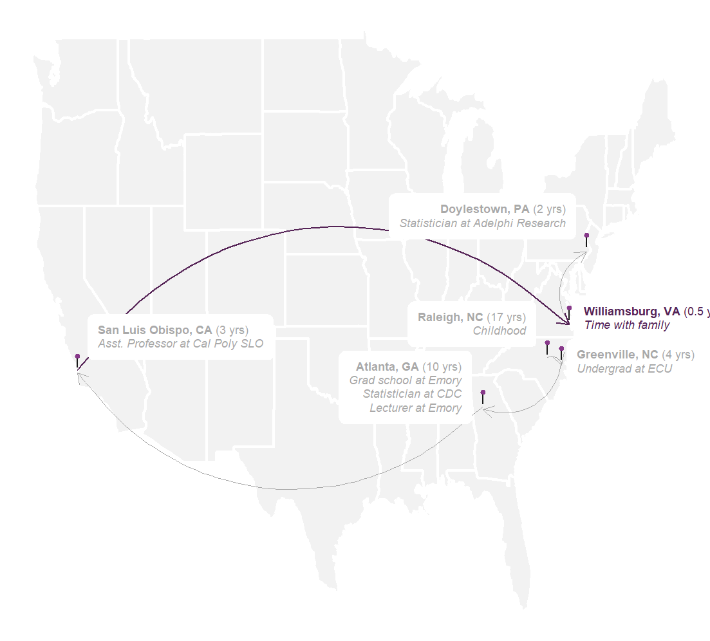

```{r setup, include = FALSE}
# loading libraries
library(tidyverse)
library(palmerpenguins)
library(fontawesome)
library(calendR)

# preset code chunk options
knitr::opts_chunk$set(dpi = 300,            # ensures high resolution images
                      echo = FALSE,         # FALSE: code chunks don't show
                      warning = FALSE,      # FALSE: suppresses warning messages
                      error = FALSE)        # FALSE: Suppresses error messages
```

class: title-slide, center, middle, inverse
background-image: url(img/PurpleSky.jpg)
background-position: bottom
background-size: cover

# `r rmarkdown::metadata$title`

### `r rmarkdown::metadata$author`

### `r rmarkdown::metadata$institute`

### `r rmarkdown::metadata$date`

Photo by [Vincentiu Solomon](https://unsplash.com/@vincentiu)

???
This slide uses:
- a custom `title-slide` class that removes the slide number from the title slide
- a background image
  - background-image: url(img/PurpleSky.jpg)
  - background-position: bottom
  - background-size: cover

---
class: inverse

.pull-left[
.center[


# R-Ladies Global 

[`r fontawesome::fa("link", fill = "#FFFFFF")` rladies.org](https://rladies.org)<br/>
[`r fontawesome::fa("twitter", fill = "#FFFFFF")` @RLadiesGlobal](https://twitter.com/rladiesglobal)<br/>
[`r fontawesome::fa("paper-plane", fill = "#FFFFFF")` info@rladies.org](mailto:info@rladies.org)<br>
[`r fontawesome::fa("slack", fill = "#FFFFFF")` Join R-Ladies Slack](https://rladies-community-slack.herokuapp.com/)
]]

.pull-right[
.center[


# R-Ladies Miami

[`r fontawesome::fa("twitter", fill = "#FFFFFF")` @RLadiesMiami](https://twitter.com/RLadiesMiami)<br/>
[`r fontawesome::fa("paper-plane", fill = "#FFFFFF")` miami@rladies.org](mailto:miami@rladies.org)<br>
]]

.footnote[
This R-Ladies themed xaringan template was kindly developed by [Silvia Canelón](https://silvia.rbind.io/). You can copy these slides with  **usethis::use_course("spcanelon/RLadies-xaringan-template")**, and learn
how to deploy them to GitHub Pages in [silvia.rbind.io/2021-03-16-deploying-xaringan-slides](https://silvia.rbind.io/2021-03-16-deploying-xaringan-slides).
]


---
class: inverse, middle, center


# Dr. Shannon Pileggi 

[`r fontawesome::fa("link", fill = "#FFFFFF")` pipinghotdata.com](https://www.pipinghotdata.com/)<br/>
[`r fontawesome::fa("twitter", fill = "#FFFFFF")` @PipingHotData](https://twitter.com/PipingHotData)<br/>
[`r fontawesome::fa("paper-plane", fill = "#FFFFFF")` shannon@pipinghotdata.com](mailto:shannon@pipinghotdata.com)<br>
[`r fontawesome::fa("linkedin", fill = "#FFFFFF")` linkedin.com/in/shannon-m-pileggi/](https://www.linkedin.com/in/shannon-m-pileggi/)


Presentation based on the Aug 30, 2020 blog post:

_A job interview presentation inspired by the R community: How TidyTuesday and Twitter helped me secure a job offer_ 

[https://www.pipinghotdata.com/posts/2020-08-30-a-job-interview-presentation-inspired-by-the-r-community/](https://www.pipinghotdata.com/posts/2020-08-30-a-job-interview-presentation-inspired-by-the-r-community/)

???
This slide uses:
- the `inverse`, `middle`, and `center` slide classes
- an image inserted with html


---

# Life changes

.right-column[

]

--

.footnote[
Map adapted from [https://www.pipinghotdata.com/posts/2021-02-15-gganimating-a-geographic-introduction/](https://www.pipinghotdata.com/posts/2021-02-15-gganimating-a-geographic-introduction/)
]

--

.left-column[

]


---

# Timeline

```{r echo=FALSE}
calendR::calendR(year = 2018, month = 12,
        special.days = c(3, 5, 17),
        special.col = "#bfe2f2",
        low.col = "white",
        text = c("Applied", "Phone screen", "Interview"), 
        text.pos = c(3, 5, 17),       # Days of the month where to put the texts 
        text.size = 4.5,               # Font size of the text
        text.col = 4 )
```


---

.left-column[
# R-Ladies Global
]

.right-column[

## Mission 

R-Ladies is a worldwide organization whose mission is to promote Gender Diversity in the R community.

The R community suffers from an underrepresentation of minority genders (including but not limited to cis/trans women, trans men, non-binary, genderqueer, agender) in every role and area of participation, whether as leaders, package developers, conference speakers, conference participants, educators, or users (see recent stats).


.footnote[

----
Original source: https://rladies.org/about-us]
]

???
This slide uses:
- the `.left-column[]` and `.right-column[]` classes
- a horizontal bar
- the `.footnote[]` class

---
# Making lists and emphasizing text

--

The R-Ladies Community has:

--

* 85,144 members

--

* Across 56 countries

--

* and 198 chapters worldwide

--


-----

And with the help of Markdown you can write text in **bold** and _italics_

--

1. And make numbered lists
1. like this one

.footnote[
These numbers come from the [Shiny R Community Explorer](https://benubah.github.io/r-community-explorer/rladies.html) developed by Ben Ubah
]

???
This slide uses:
- bullet list with `*`
- incremental slides divided by `--`
- numbered list with `1.`
- a horizontal bar
- the `.footnote[]` class

---
# Inserting images

```{r, echo = TRUE, fig.alt="World map with countries that have R-Ladies chapters highlighted in purple"}
knitr::include_graphics("img/RLadiesMap.png")
```

--

> Note: You can use the `fig.alt` code chunk option to add alternative text to your images, that way they are accessible to screen reader users:
- In code chunk: `{r, fig.alt = "<descriptive alt text>"}`.
- Read more about this in [{knitr} NEWS.md](https://github.com/yihui/knitr/blob/master/NEWS.md#new-features-1)

???
This slide uses:
- an image inserted with `knitr::include_graphics()`
- the `fig.alt =` code chunk option for alternative text

---
# Tables and quotes

### Table

.pull-left[

`palmerpenguins::penguins`

The `penguins` dataset contains size measurements for adult penguins nesting near Palmer Station in Antarctica.

Measurements like `body_mass_g`
]

.pull-right[

```{r}
palmerpenguins::penguins %>%
  select(species, island, body_mass_g) %>%
  arrange(body_mass_g) %>%
  head() %>%
  knitr::kable(format = 'html')
```
]

???
This slide uses:
- the `.pull-left[]` and `.pull-right[]` classes
- an R code chunk to produce the html table

--

### Quote

> You can read more about the `palmerpenguins` data package authored and maintained by Allison Horst at [allisonhorst.github.io/palmerpenguins](https://allisonhorst.github.io/palmerpenguins/)

???
- a quote with `>`

---
# Highlighting code

`> This is what inline code looks like`

You can highlight lines of code within code chunks using `#<<`:

### Code

```r
palmerpenguins::penguins %>%
  ggplot(aes(x = island, y = body_mass_g)) +
  geom_boxplot(aes(fill = island))               #<<
```

### Output

```{r eval=FALSE, echo=TRUE}
palmerpenguins::penguins %>%
  ggplot(aes(x = species, y = body_mass_g)) +
  geom_boxplot(aes(fill = island))               #<<
```

???
This slide uses:
- inline code highlighting with backticks ` `` `
- a code chunk to produce a ggplot

---

```{r penguin-body-mass, eval=TRUE, echo=TRUE, fig.height = 4.5}
palmerpenguins::penguins %>%
  ggplot(aes(x = species, y = body_mass_g)) +
  geom_boxplot(aes(fill = island))               
```

???
This slide uses:
- a code chunk to produce a ggplot
- code chunk option `fig.height = 4.5` to control the figure height

---
class: middle, inverse, title-slide

.pull-left[
# Thank you!
<br/>
## Shannon Pileggi  
]

.pull-right[
.right[


[`r fontawesome::fa("link", fill = "#FFFFFF")` pipinghotdata.com](https://www.pipinghotdata.com/)<br/>
[`r fontawesome::fa("twitter", fill = "#FFFFFF")` @PipingHotData](https://twitter.com/PipingHotData)<br/>
[`r fontawesome::fa("paper-plane", fill = "#FFFFFF")` shannon@pipinghotdata.com](mailto:shannon@pipinghotdata.com)<br>
[`r fontawesome::fa("linkedin", fill = "#FFFFFF")` linkedin.com/in/shannon-m-pileggi/](https://www.linkedin.com/in/shannon-m-pileggi/)
]]

???
Thank you for joining me!
You can find my contact information linked on this slide if you want to get in touch, and I'm happy to take any questions.

This slide also uses:
- the `title-slide` class, to remove the slide number at the bottom :)
